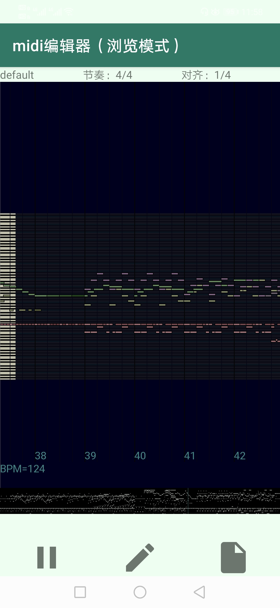
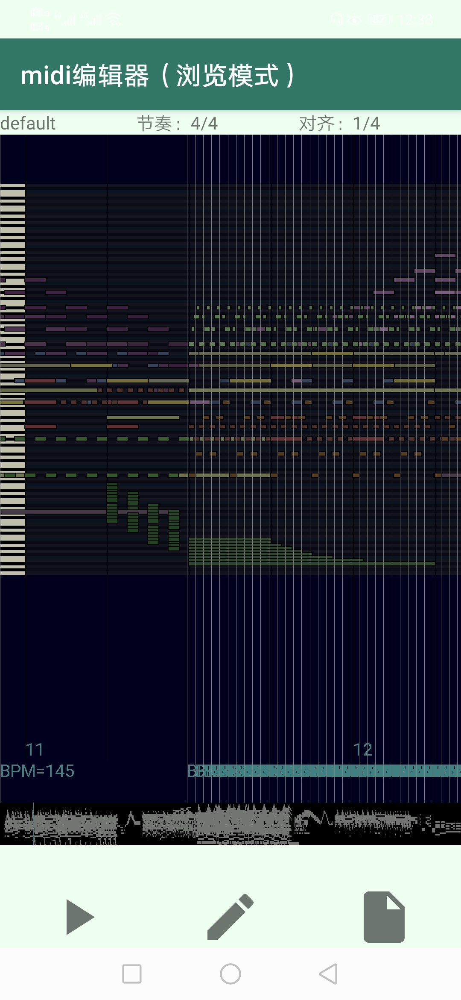
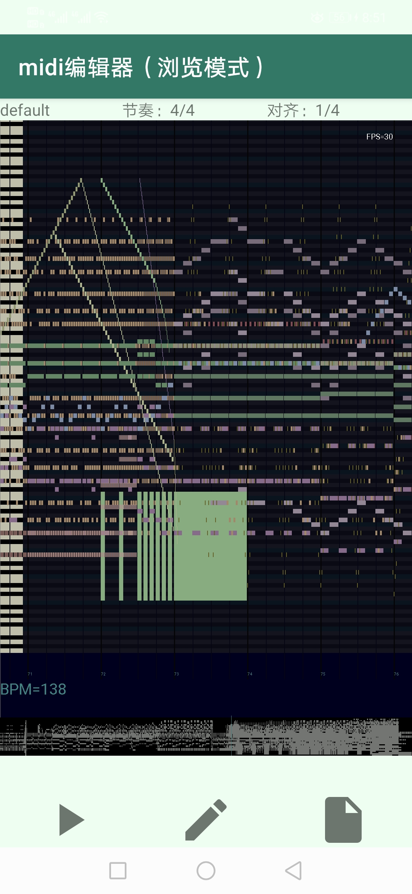

# mgenner-droid

#### 介绍
安卓高性能MIDI编辑器，编辑黑乐谱时依旧可以做到平均60fps，高能部分30+fps，并可以瞬间添加音符  

##### 界面展示
  
  
  

#### 使用方法
[点击下载MGenNer](app/release/app-release.apk)  
[点击下载midilib完整app](https://midi.sinriv.com/app/)  

#### 编译方法

建议使用Android Studio编译，ndk需要支持C++20  

#### 参与贡献

1.  Fork 本仓库
2.  新建 Feat_xxx 分支
3.  提交代码
4.  新建 Pull Request

